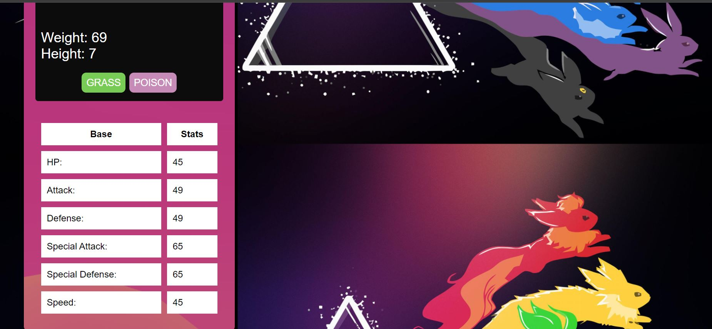

# Pokémon Search App 🚀

Welcome to the Pokémon Search App! This app allows you to search for Pokémon by name or ID and displays detailed information about each Pokémon, including its type, stats, and more.

## Demo 📸




## Live Link

https://faridafaqiri.github.io/pokemon-search-app/

## Features ⭐

Search Functionality: Search for Pokémon by name or ID.
Detailed View: Display detailed information about each Pokémon, including its image, weight, height, types, and base stats.
Type Colors: Each Pokémon type is color-coded for easy identification.
Responsive Design: The app is fully responsive and works on different screen sizes.

## Technologies Used 🛠️

HTML5: For structuring the app.
CSS3: For styling and layout.
JavaScript: For adding interacti
vity and fetching data from the API.
PokeAPI: For providing Pokémon data.

## Installation 💻

To explore the project, follow these steps:

1. Clone the repository to your local machine:

```bash
git clone git@github.com:Fikrat2002/cash-register.git
```

2. Navigate to the cloned directory:


```bash
cd cash-register
```

3. Open the index.html file in your web browser.

## Usage 🎯

1. Search for a Pokémon:
  Enter the name or ID of the Pokémon in the search input.
  Click the "Search" button or press "Enter".

2. View Pokémon Details:
The app will display detailed information about the Pokémon, including its image, name, ID, weight, height, types, and base stats.

## Contributing

Contributions are welcome! Please fork the repository and submit a pull request with your improvements.

## Author 👩‍💻

You can contact me through the following:

- LinkedIn: (<https://www.linkedin.com/in/farida-faqiri-071a31309/>)
- Email: (<farida.faqiri2@gmail.com>)
